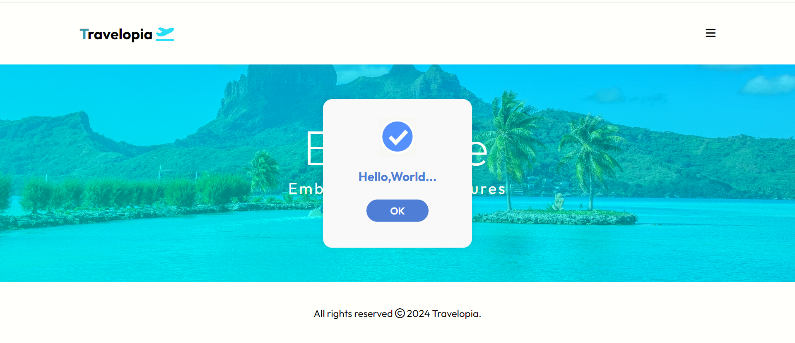

## Travelopia-TripPlanner

Travelopia is a single-page web component designed to provide a sleek and dynamic user experience for exploring travel options. It incorporates a 100px navbar, 100px footer, an image with overlay text, and a click-triggered alert button. The design is crafted using HTML, CSS, and JavaScript, with a focus on responsiveness and usability.

### Deployed Link

[Live Demo](https://travelopia-trip-planner.vercel.app/)

### Screenshots

#### Mobile View

#### Desktop View

#### Pop-up Alert

## Features

- **Navbar and Footer**: Both have a fixed height of 100px each, providing consistent navigation and information throughout the page.
- **Dynamic Design**: A single-page component with fluid layout adjustments to accommodate different screen sizes, ensuring a seamless user experience.
- **Image with Overlay Text**: An image positioned between the navbar and footer, with translucent overlay text for added visual appeal.
- **Alert Button**: Functionality to trigger an alert message upon clicking, enhancing user interaction.
- **Title and Banner**: Centered on the page and overlay, providing a focal point for the content.
- **Responsive Hamburger Menu**: Ensures accessibility and ease of navigation on smaller devices.

## Tech Stack

- **HTML**: Provides the structure and content for the web page.
- **CSS**: Handles the UI and styling, ensuring an appealing visual presentation.
- **JavaScript**: Implements functionality such as the alert button and dynamic design elements.
- **Responsive Design**: Utilizes media queries and flex layouts to adapt the page layout across various devices.
- **Fonts & Icons**: Integrates Google Fonts and FontAwesome icons for enhanced typography and visual elements.

## How to Use

To run this project locally:

1. Clone this repository to your local machine.
2. Open the `index.html` file in your preferred web browser.
3. Explore the Travelopia experience right from your device.

## Contributors

- [shashikantRupin](https://github.com/shashikantRupin/Travelopia-TripPlanner)

## License

This project is licensed under the MIT License - see the [LICENSE](LICENSE) file for details.

## Acknowledgments

- Inspired by the beauty of travel and exploration.
- Special thanks to the supportive community at [Travelopia].

